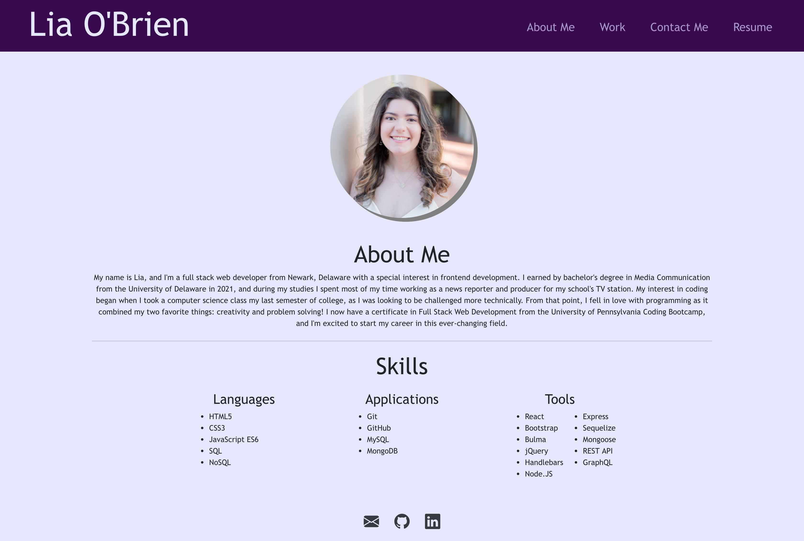

# react-portfolio

This is an updated version of my developer portfolio powered by React. It contains pages for my personal bio, my recent projects, and a built-in contact form.

My portfolio can be viewed here: [https://liaobrien.github.io/react-portfolio/](https://liaobrien.github.io/react-portfolio).

## Table of Contents

- [Installation](#installation)
- [Usage](#usage)
- [Credits](#credits)
- [License](#license)
- [Questions](#questions)

## Installation

N/A

## Usage

This page can be accessed and used on any standard web browser.

## Credits

CSS framework Bootstrap is being utilized.

## License

This project is licensed under the MIT license.

## Questions

## Questions

If you have any questions about this repository, you contact me directly at liaobrien123@gmail.com. You can also find more of my work at [liaobrien](https://github.com/liaobrien).
